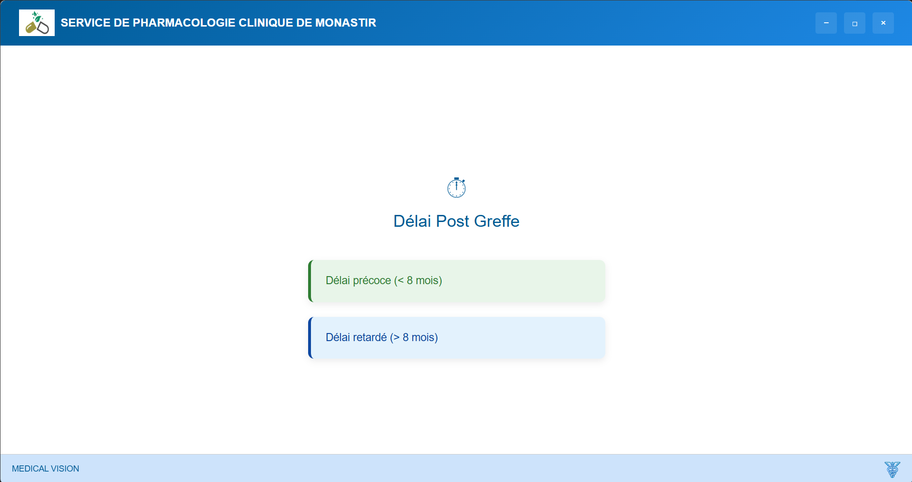

## 📌 Project Overview
This project focuses on enhancing clinical decision-making through AI-powered predictive modeling. It is developed in collaboration with doctors and engineers at Fattouma Bourguiba Hospital to improve the prescription process and patient outcomes.

## 🧠 Objectives
- Develop and train machine learning models to **predict optimal drug dosages** for different diseases.
- Ensure model accuracy and reliability for **clinical application**.
- Embed these models into a **desktop application** for practical use by healthcare professionals.

## ⚙️ Key Features
- AI-driven recommendations for drug dosages.
- Interactive user interface tailored to medical workflows.
- Integration of medical datasets with real-time processing.
- Model evaluation using metrics like accuracy, precision, recall, F1 score, and MAE.

## 🛠 Technologies Used
- **Languages:** Python, JavaScript (React for frontend)
- **ML Libraries:** scikit-learn, XGBoost, LightGBM
- **Database:** MySQL 
- **Frameworks:** Flask (for backend API), Electron (for desktop app)
- **Tools:** Git, VS Code, Jupyter Notebooks
  
